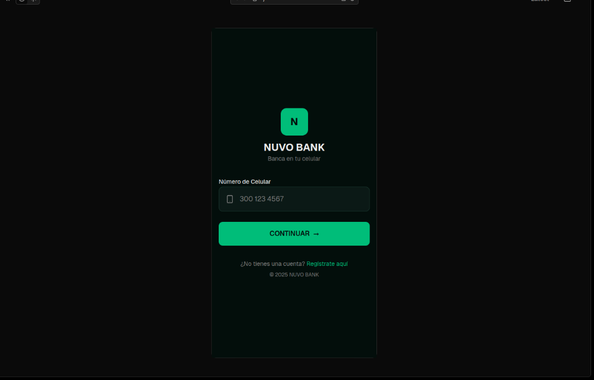
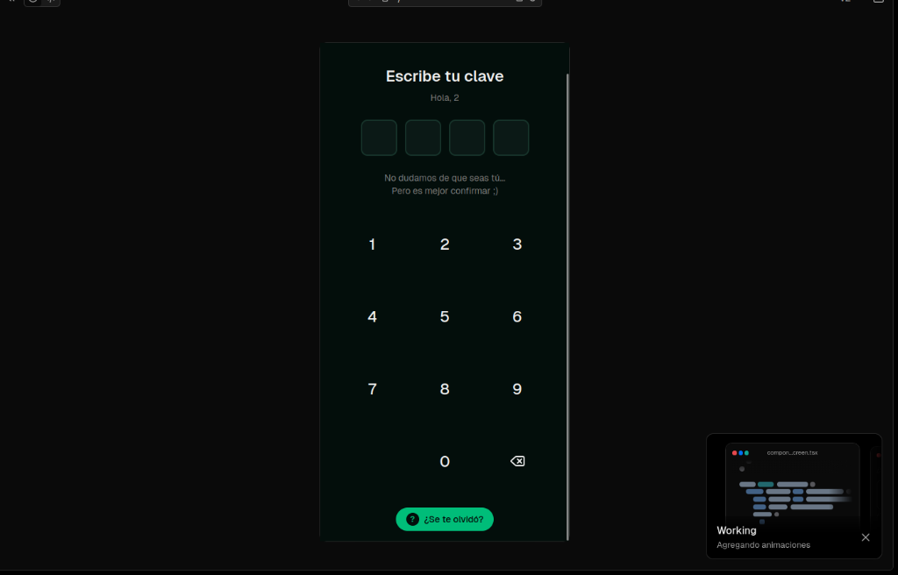
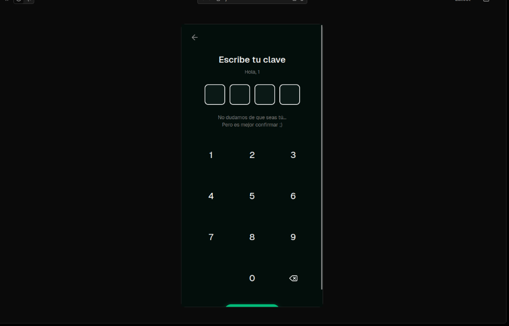
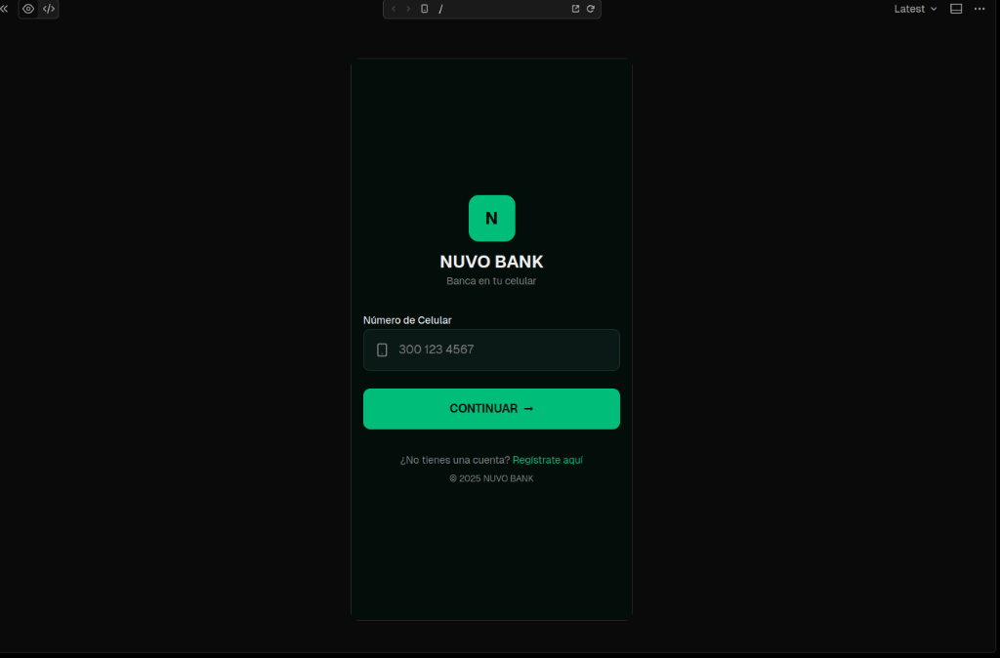

# 📱 NUVO - Visual Prototype (Mobile App)

This document presents the visual prototype of the NUVO mobile application, showcasing the key screens for user interaction.

## 1. Splash Screen
The initial screen displayed when the application launches, featuring the NUVO Bank logo.

## 2. Login Screen (Phone Entry)
The user enters their phone number to identify their account.

## 3. Login Screen (PIN Entry)
After identifying the account, the user enters their secure PIN to access the application.

## 4. Home Screen (Dashboard)
The main dashboard where users can see their account balance, recent transactions, and quick actions.

